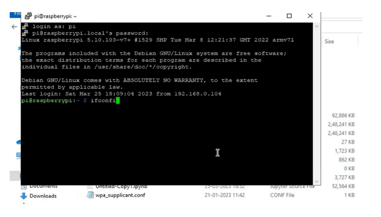
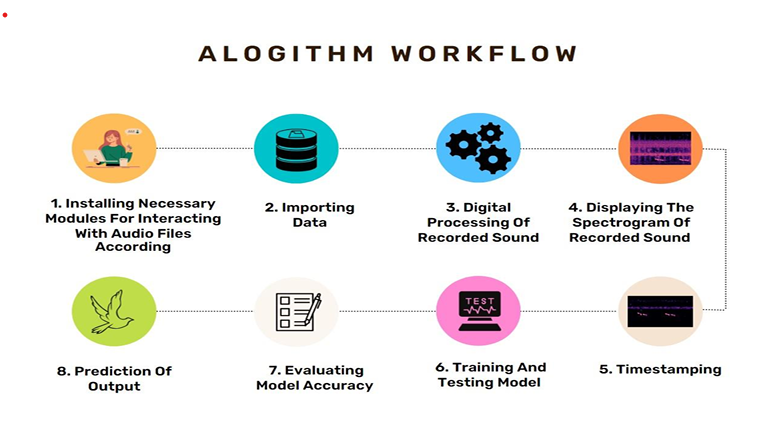
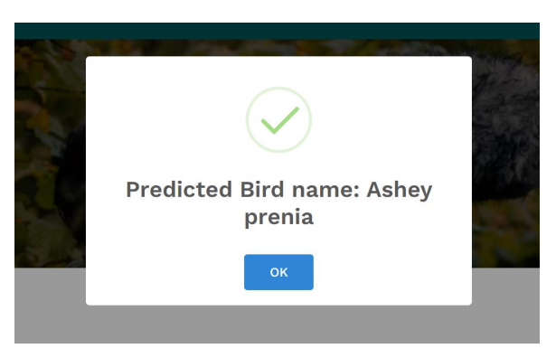

# sound-based-bird-identification-system
This project is a Sound-Based Bird Identification System using a Raspberry Pi to record and identify bird species by analyzing their sounds. It helps birdwatchers and visually impaired individuals study birds where visual identification is difficult, making it a valuable tool for research, education, and conservation.

## Features

- **Real-Time Sound Analysis**: Records and identifies bird species based on their vocalizations.
- **Accessibility**: Supports visually impaired individuals in learning about birds through sound.
- **Research and Education**: Aids in studies related to bird behavior, migration, and climate change.
- **Easy Setup**: Requires only a Raspberry Pi and a microphone to operate.

## Requirements

- Raspberry Pi (any model with USB ports)
- USB Microphone
- Bird identification software (to be specified)
- Internet connection (optional for software updates)

## Installation

1. **Set Up Raspberry Pi**:
    Install the latest version of Raspberry Pi OS on your device.
   - Configure libraries and ML models on Raspberry Pi for running the application.
   - Integrate with a user interface (UI) for enhanced accessibility and ease of use.
   - Connect the USB microphone.
  
## Raspberry-Pi Setup 
# Prerequisite tools we need for setup are Putty terminal for establising connection with raspberry Pi and Thony Compiler for integrating ML Model in Raspberry-Pi

1. After Successful installation of Raspbian pi Operating system in raspberry pi motherboard we
provide default raspberry pi login credentials to access the Raspbian os in the putty terminal Where
default user name of raspberry pi is root then we run one more command ipconfig command to
show Ip configuration of raspberry.

## Algorithm workflow

## Login Page
This is What Landing page of User Interface for User to log in on.

## Recording Page 
This is where User is Supposed to Record the input Audio for which he/she needs to predict the Bird Species 

## Output window 
Following is how User will receive the Predicted Output for Sound He/she has given to System

